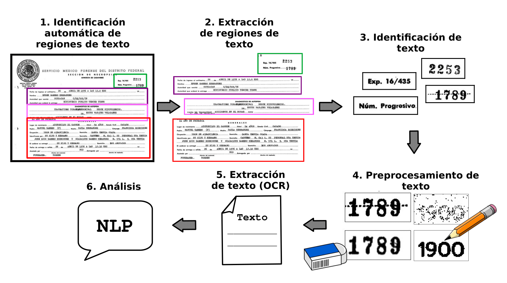

# Identificación y extracción de texto de expedientes relacionados a desapariciones forzadas durante el periodo de la "guerra sucia" en México.
Oscar De la Cruz Echeveste

## Objetivo
 Implementar técnicas que ayuden a la __identificación y extracción automática de texto de los documentos expedidos por la SEMEFO__. Al final se creará un a API que el equipo de la CNB usará para transcribir todos estos documentos y ser agregados al Angelus.
 
 ## Metodología

