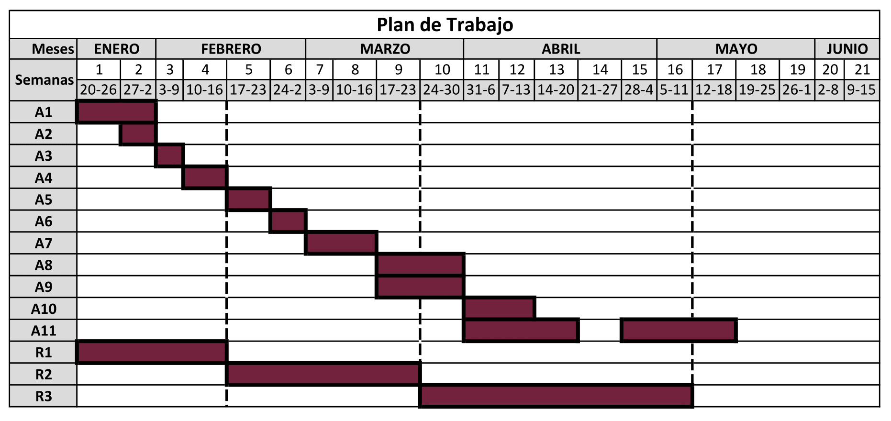

# Identificación y extracción de texto de expedientes relacionados a desapariciones forzadas durante el periodo de la "guerra sucia" en México.
__Presenta__: Oscar De la Cruz Echeveste

__Asesor__: Dr. Víctor Muñiz Sánchez

## Objetivo
 Implementar técnicas que ayuden a la __identificación y extracción automática de texto de los documentos expedidos por la SEMEFO__. Al final se creará un a API que el equipo de la CNB usará para transcribir todos estos documentos y ser agregados al Angelus.
 
 ## Metodología

## Cronograma

*   __A1__: Preparación y presentación del protocolo de tesis.
*   __A2__: Etiquetar regiones de texto en los documentos (Roboflow).
*   __A3__: Entrenar modelo de red neuronal con YOLO v5 para identificación de las regiones requeridas.
*   __A4__: Extracción (recortes) de regiones de texto en documentos de prueba.
*   __A5__: Implementar modelo de identificación de texto (CRAFT) en cada región extraída.
*   __A6__: Recorte y ordenamiento del texto.
*   __A7__: Entrenar modelos de Deep-Eraser para remover artefactos y reparar el texto dañado.
*   __A8__: Implementar métodos de preprocesamiento de imágenes en cada recorte.
*   __A9__: Implementar Tesseract para transcripción de texto de las imágenes preprocesadas.
*   __A10__: Construcción de la API.
*   __A11__: Preparación de Cartel.  
*   __R__: Reportes.

