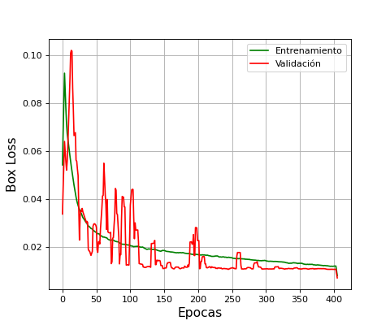
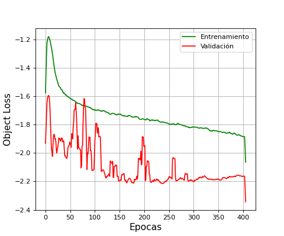
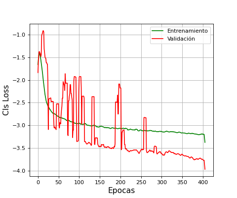
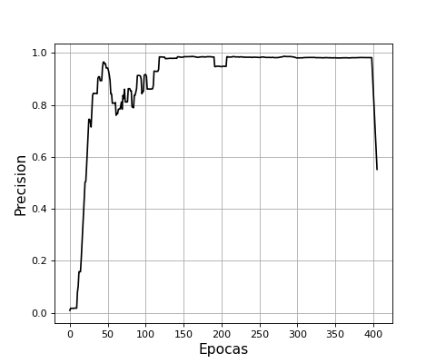
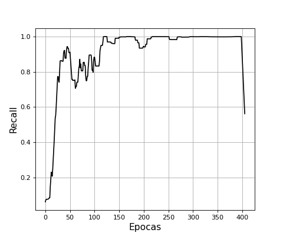

# Construcción de modelos de YOLO

Se llevó a cabo el entrenamiento del modelo de YOLOv5 XLarge   

__Matriz de confución__

__Funciones de perdida en cada época__

  
  
  

__Precisión__

  
  
  

